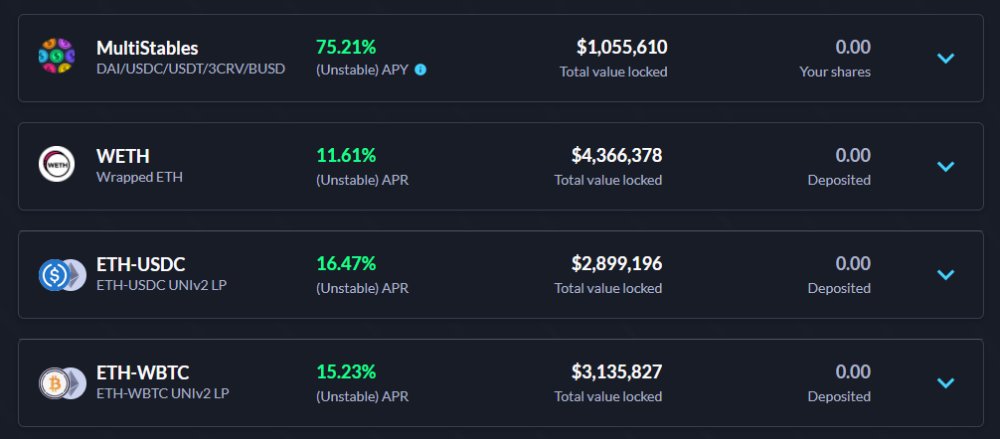
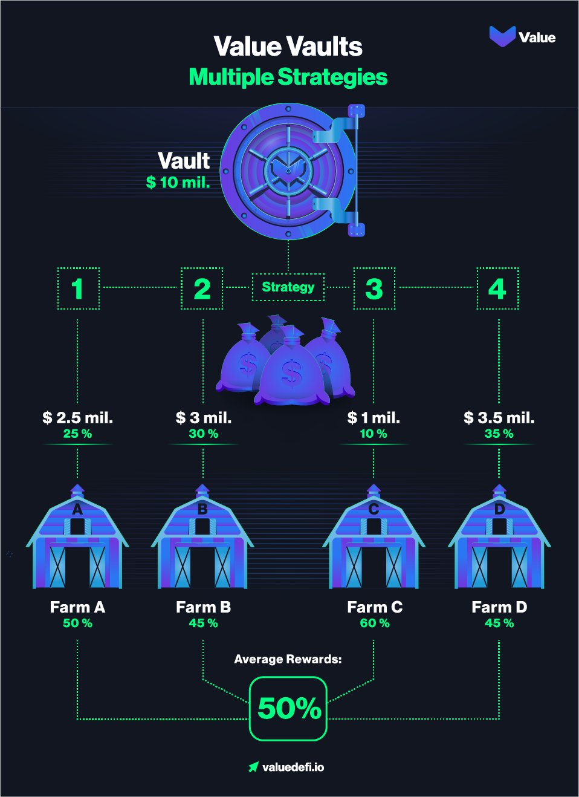

Vaults allow you to increase your holdings of an asset at a low gas cost and with low effort. It is a 'set it and forget it' method as the Vaults do everything for you.

---

## What are Value Vaults?

Instead of searching for the best yields for your tokens, stake your tokens in our vaults and **let us do the hard work for you.**

Value Vaults are yield aggregators that put your assets to work, **we search for the highest returns** and use multiple strategies to keep the returns as high as possible.

Before deploying any assets **we check the underlying contracts for both security and hidden fees** to guarantee your funds are safe and secure.

## How do Value Vaults work?

The Value Vaults use your assets (such as USDC, wETH, wBTc, etc) to farm other DeFi protocols after thorough vetting by the Value DeFi team to prevent rugpulls.

We pay the gas fees to farm other protocols, we remove your assets when farming has finished and we look for another opportunity to deploy your assets. By farming these other protocols we receive rewards.

The rewards of these protocols are sold to your original asset, which increases your holding and maintains your exposure.

## Vault Fees

As a fee for providing you returns on your assets, Value DeFi uses 14% of the profits earned to reward stakers in our [Governance Vault](./GovernanceVault). This is known as the **performance fee.**

When the Harvest() function is called on each of the vaults, the performance fee is used to buy VALUE tokens for the Governance Vault stakers. The remaining 86% will be paid to you for providing the assets to our vaults. **This 86%, paid to you, makes up the APY displayed beside each vault.**

**There is a 0% withdrawal fee from all our vaults**, you can remove your assets at any time without incurring a fee.

## Multiple strategy Vaults

Our vaults are interesting and unique in that they can use multiple strategies to farm multiple pools. This way you get the best optimal return by having your fingers in many pies.

The infographic below shows how we optimize the Vault funds to increase yield. To prevent dilution of the APY of the farmed pool, only a part of the Vaults funds are allocated to it so that the pool APY is less affected.

Using the example above, allocating $1M of our Vault would bring the Farm to $2M TVL (1M+1M) provide us with 55% APY (110%/2).

This is also done for the remaining funds in the Vault, those are distributed to use on other farms to acquire the best return on the deposited Vaults assets, resulting in for example a 50% APY compared to 10% with single assets.

## Auto-compounding of rewards

An extra feature is the **auto-compounding of rewards**, this saves you gas costs and allows you to gain rewards faster as opposed to non-compounding.

## Cheaper gas fees

Due to all users pooling their funds together, gas fees get cheaper as they are shared between users. This ensures that small farmers don’t see their ROI shrink massively.

For example, instead of 100 different people each paying a $10 transaction fee to deposit $1,000 in a pool, these 100 people are paying $10 to pool their tokens and deposit $100,000. The gas cost is reduced from $1,000 ($10 \* 100 transactions) to just $10. Each vault investor effectively paid a transaction fee of just one cent ($10 / 100 people).

The same applies to other actions such as claiming rewards, withdrawing from the pools, etc.

## Vaults FAQ's

**When is the harvest called?**

All Vaults work in the same way (YFI, YFII etc) that we will call the harvest.

How often depends on the performance of the strategy, 6hr or 12hr or 24 hr. Calling the harvest() function will auto sell, for example, Soda, and buy WETH, VALUE, and distribute accordingly.

Source: https://medium.com/p/vip-7-yfv-value-swap-deadline-closing-seed-pool-v2-vault-fee-adjustments-dc188187b229).

You can see regular harvest calls on our discord.
